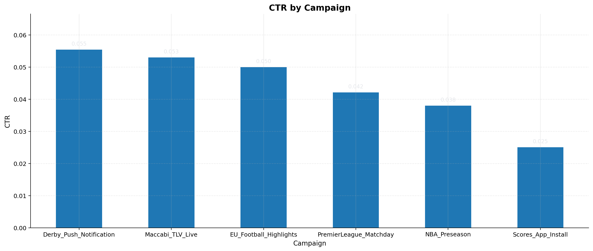
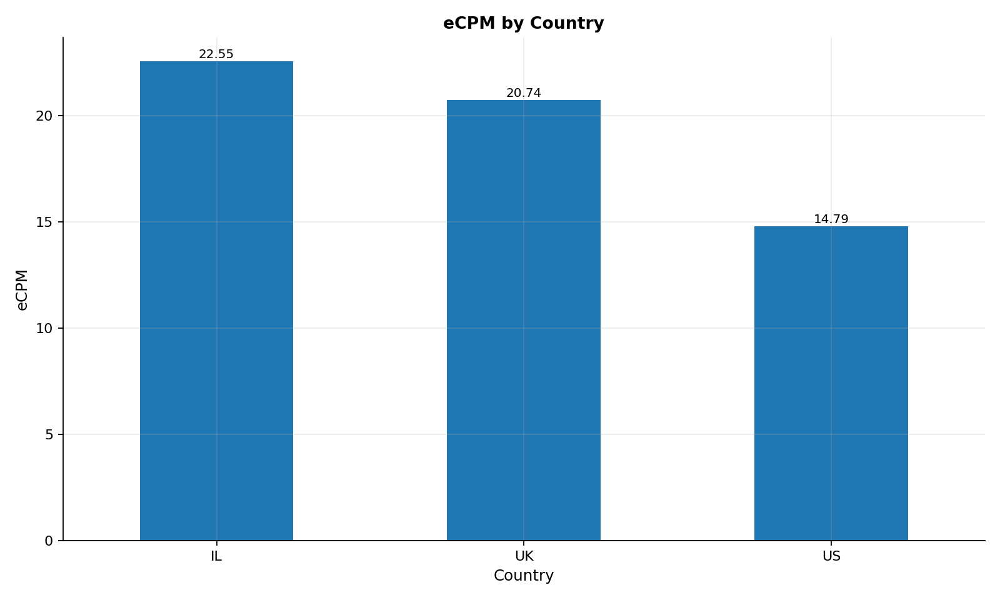
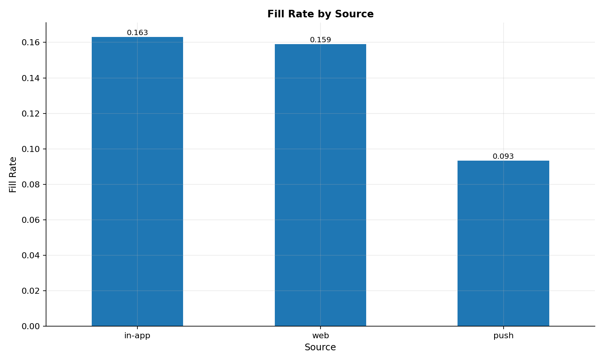

# 📊 AdOps Data Pipeline – ETL & Reporting with Python

A professional **ETL (Extract–Transform–Load) pipeline** built for Ad Operations data.  
The project demonstrates an end-to-end data flow — from raw CSV files to an SQLite warehouse and analytical reports with visual charts.

---

## 🚀 Features
- End-to-end ETL (Extract → Transform → Load)
- Cleans and merges multiple CSV sources
- Computes campaign KPIs:
  - **CTR** (Click-through rate)
  - **Fill Rate**
  - **eCPM** (Effective cost per thousand impressions)
- Saves results to:
  - **SQLite database**
  - **Parquet file**
- Generates **matplotlib charts** for quick insights

---

## 🧱 Project Structure
```
adops_pipeline/
│
├─ data/
│ ├─ raw/ # Input CSVs
│ └─ warehouse/ # Output (SQLite + Parquet)
│
├─ etl/
│ ├─ config.py # Paths & constants
│ └─ etl.py # Main ETL logic
│
├─ reports/
│ └─ analysis.py # Visualization & reporting
│
├─ tests/
│ └─ test_etl.py # Simple Pytest checks
│
├─ requirements.txt
└─ README.md
```

---

## 🛠 Tech Stack
**Python libraries**
- `pandas`, `numpy`
- `SQLAlchemy`, `pyarrow`
- `matplotlib`
- `pytest` (for testing)

**Storage**
- SQLite + Parquet

---

## ⚙️ Setup
```bash
python -m venv .venv
```
# Windows:
```
.\.venv\Scripts\activate
```
# macOS/Linux:
```# source .venv/bin/activate
pip install -r requirements.txt
```
▶️ Run the Pipeline
1️⃣ Build the warehouse
```
python -m adops_pipeline.etl.etl
```
Output example:
```
Loaded 6 rows → fact_metrics
SQLite: data/warehouse/adops.db
Parquet: data/warehouse/metrics.parquet
```
2️⃣ Generate charts
```
python -m adops_pipeline.reports.analysis
```
Charts will be saved to:
```
reports/charts/
  ctr_by_campaign.png
  ecpm_by_country.png
  fillrate_by_source.png
```
## 📸 Example Output
### CTR by Campaign


### eCPM by Country


### Fill Rate by Source


## 🔮 Future Improvements
- Automate daily ETL runs with cron / Airflow
- Add anomaly detection for campaign performance
- Integrate dashboard (e.g., Plotly Dash / Streamlit)
- CI with GitHub Actions
## 👤 Author
**Matanya Kedem**

[LinkedIn](https://www.linkedin.com/in/USERNAME) • [GitHub](https://github.com/USERNAME)
